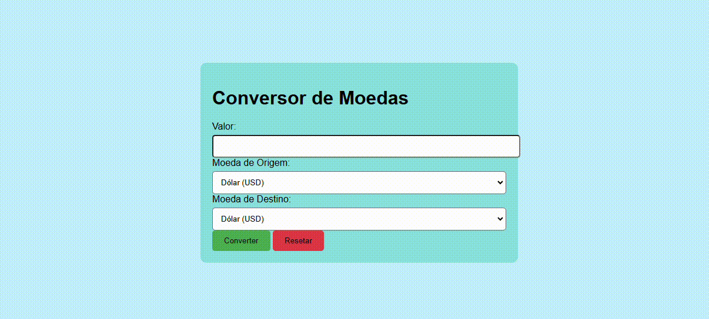

# conversor-de-moedas

# Descrição:

Este projeto consiste em um conversor de moedas simples, desenvolvido em HTML, CSS e JavaScript. A aplicação permite ao usuário inserir um valor em uma moeda específica e convertê-lo para outra moeda, exibindo o resultado na tela.

# Funcionalidades:

Conversão de moedas: Permite converter entre as seguintes moedas: Dólar (USD), Euro (EUR), Real (BRL), Libra Esterlina (GBP), Iene (JPY), Dólar Canadense (CAD) e Dolar Australiano (AUD).

Interface intuitiva: Possui uma interface simples e fácil de usar, com campos para inserir o valor, selecionar a moeda de origem e a moeda de destino.

Taxas de câmbio: Utiliza um objeto JavaScript com as taxas de câmbio fixas para realizar as conversões.

# Tecnologias Utilizadas:

HTML: Estrutura da página e elementos da interface do usuário.

CSS: Estilização da página, definindo layout, cores e fontes.

JavaScript: Lógica da aplicação, incluindo a captura de dados do usuário, cálculos das conversões e atualização da interface.

# Estrutura de Arquivos:

index.html: Arquivo principal da aplicação, contendo o código HTML.

style.css: Arquivo CSS com as regras de estilo da página.

script.js: Arquivo JavaScript com a lógica da aplicação.

Como Usar:

# Clonar o repositório: Clone este repositório para sua máquina local.
Abrir em um navegador: Abra o arquivo index.html em um navegador web.

Realizar a conversão:
Insira o valor a ser convertido no campo "Valor".

Selecione a moeda de origem e a moeda de destino nos respectivos menus dropdowns.

Clique no botão "Converter" para realizar a conversão.

O resultado da conversão será exibido abaixo.

Resetar: Clique no botão "Resetar" para limpar os campos e iniciar uma nova conversão.

# AUTORA

[Dafila] - [https://github.com/mendesdafilla]